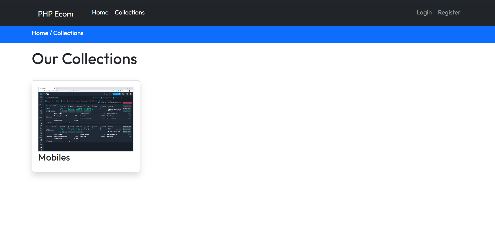
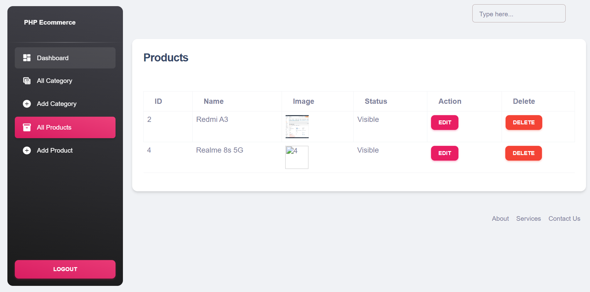
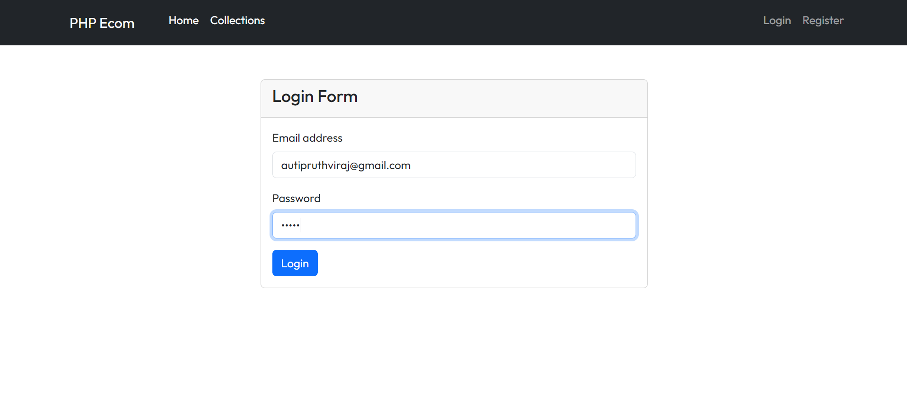
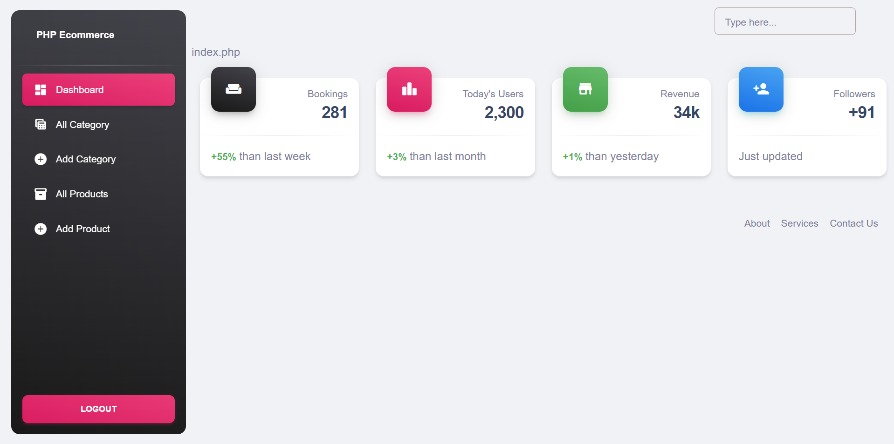
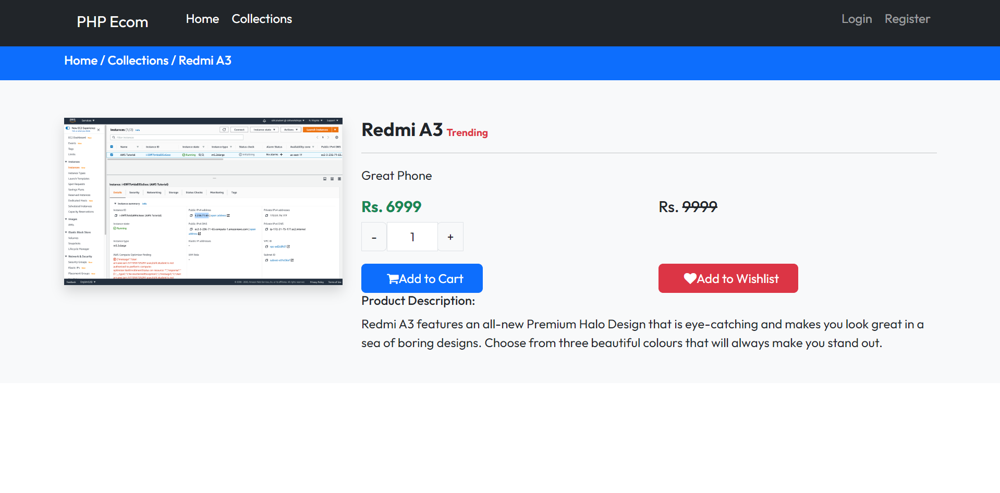

# E-Commerce Website

Welcome to our E-Commerce Website! This platform allows users to browse and purchase a wide range of products. It includes features such as user authentication, shopping cart management, secure payment processing, and order tracking.

## Table of Contents

- [Overview](#overview)
- [Features](#features)
- [Getting Started](#getting-started)
  - [Prerequisites](#prerequisites)
  - [Installation](#installation)
  - [Running the Project](#running-the-project)
- [Usage](#usage)
  - [User Authentication](#user-authentication)
  - [Browsing Products](#browsing-products)
  - [Shopping Cart](#shopping-cart)
  - [Payment Processing](#payment-processing)

## Overview

This e-commerce website is built to provide a seamless online shopping experience. It includes a comprehensive product catalog, user accounts, a secure checkout process, and an admin interface for managing products and orders.

## Features

- User authentication (signup, login, logout)
- Product browsing and search functionality
- Shopping cart with item addition and removal
- Order tracking and history
- Admin panel for product and order management

## Getting Started

To set up the project locally, follow the steps outlined below.

## Prerequisites

- PHP (specify the version you used)
- MySQL (specify the version you used)
- Web server (e.g., Apache, Nginx)

## Installation

1. Clone the repository or download the source code:

```bash
cd https://github.com/pruthvii09/PHP-Ecom.git
```

2. Navigate to the project directory:
3. Create a new MySQL database and import the provided SQL file (`database.sql` or similar) to set up the required tables and data.

4. Rename the `config.example.php` file to `config.php` and update the database credentials with your own:

```php
$host = "localhost";
$username = "your_mysql_username";
$password = "your_mysql_password";
$database = "your_database_name";
```

### Example Screenshot

#### HomePage



#### All Products



#### Login



#### Admin Dahsboard



#### Product Page



## Tech Stack

- PHP + MySQL
- Bootstrap
- jQuery

##### by [@Pruthviraj Auti](https://portfoliobuilderpruthvi.vercel.app/pruthvii)
